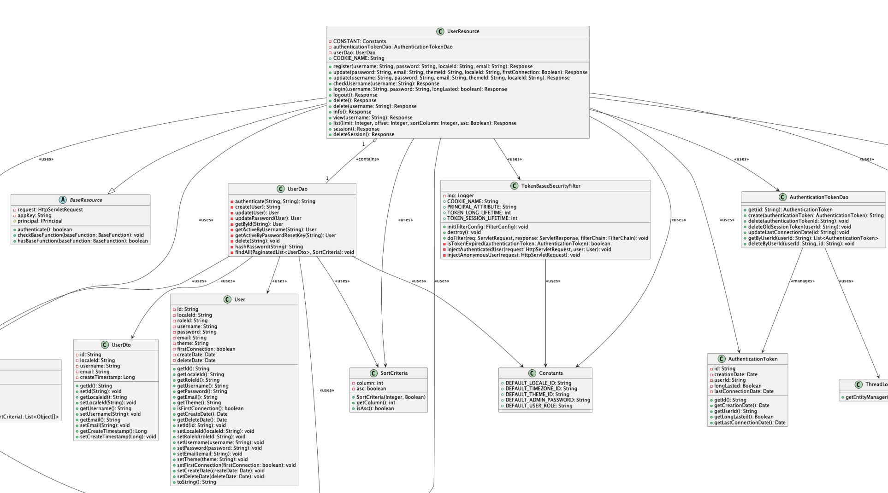
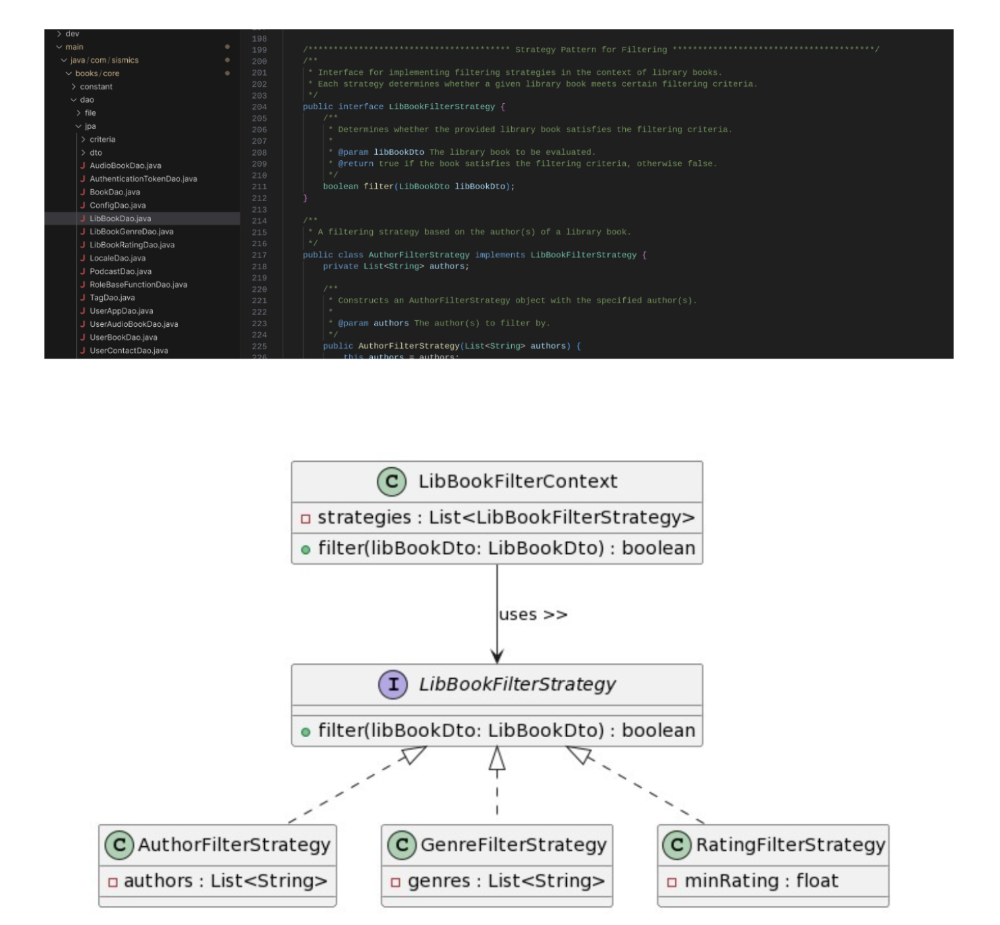
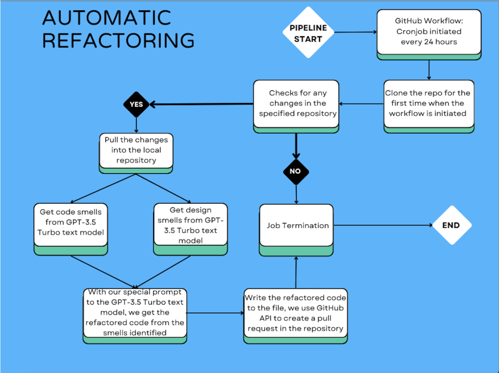

# Few Software Engineering Projects

A couple of the projects done as part of the course [CS6401: Software Engineering](https://karthikv1392.github.io/cs6401_se/).

## Contents

The corresponding code and reports have been added as subdirectories with their commits squashed into this repository's main branch.

The following summaries have been generated by ChatGPT to showcase the objectives of each.

### Project 1

- Analyzed and refactored an existing web-based book management app.
- Identified and addressed design smells using automated tools like Sonarqube.
- Documented system functionality, class behaviors, and relationships using UML diagrams.
- Conducted comprehensive code metrics analysis to assess software quality and maintainability.
- Improved codebase maintainability and readability through systematic refactoring.
- Gained practical experience in applying software engineering principles to real-world projects.

### Project 2

- Expanded functionality of the Books repository using design patterns.
- Implemented user-friendly features like self-registration and common library management.
- Integrated Spotify and iTunes for audiobooks and podcasts access.
- Enhanced user experience through robust error handling and validation.
- Documented system architecture and design patterns effectively.
- Applied Object-Oriented Programming principles to ensure modularity and maintainability.

### Project 3

- Designed and implemented an application software for ML model training, testing, and logging.
- Adopted chunked file transfer for efficient handling of large files between React frontend and Flask backend.
- Integrated Google Drive for storing large datasets and local storage for code and non-data files.
- Developed a robust SQL-based database schema for efficient management of user repositories and files.
- Conducted a comparative study between monolithic and microservices-based prototypes.
- Applied IEEE 42010 Stakeholder Identification and architectural design records for making appropriate architectural choices.

### Automated Refactoring

- Developed a script to periodically scan the GitHub repository for design smells. Utilize the capabilities of Language Models (LLMs) to assist in identifying potential design issues in the codebase.
- Automated refactoring and pull request generation using GitHub workflows.

