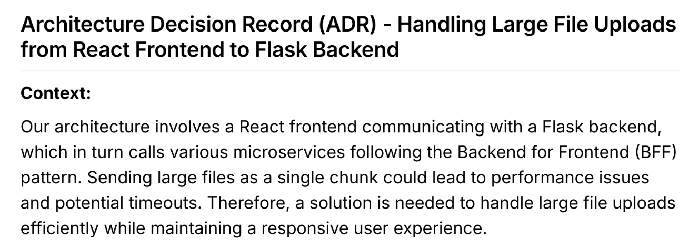
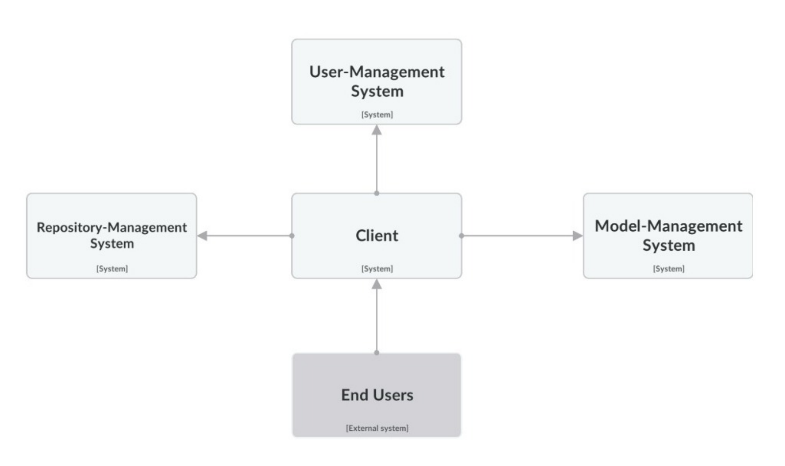

## SE Project-3: ModelHub

Please refer to the report's PDF [here](https://github.com/FlightVin/few-software-engineering-projects/blob/main/project-3/SE%20Project-3%20report.pdf) for all the details. Attached is an LLM generated summary.

## Project Summary: ModelHub Software Architecture

### Overview
ModelHub is an application designed to streamline the training, testing, and logging of Machine Learning (ML) models online. Inspired by established platforms like Weights & Biases and Kaggle, it aims to enhance user experience by providing a user-friendly interface that allows users to manage ML models efficiently.

### Architectural Framework
The architecture of ModelHub is structured around several key components, following the IEEE 42010 framework for architecture description.

#### Subsystems
1. **User Management**: Facilitates user authentication and profile management, ensuring secure access to personalized features.
  
2. **Repository Management**: Organizes and stores project-related resources, enabling users to manage their code and data efficiently.

3. **Model Management**: Empowers users to train, evaluate, and deploy ML models, providing features for hyperparameter tuning and performance monitoring.

### Architectural Decisions
The project adopted a **microservices architecture** over a monolithic approach, allowing for independent scaling and maintenance of different components. This decision enhances modularity, fault isolation, and the ability to utilize diverse technology stacks for optimization.

#### Key Architectural Decisions:
- **File Storage Strategy**: Large datasets are stored in Google Drive, while code files are also managed through this platform to simplify storage management. This approach ensures scalability and cost-effectiveness.
  
- **Handling Large File Uploads**: A strategy was developed to manage uploads efficiently from the React frontend to the Flask backend, ensuring performance and usability.

### Architectural Tactics and Patterns
The project incorporates several architectural tactics to address key concerns:

- **Availability**: Designed to ensure 99% uptime, allowing reliable access to the application.
  
- **Security**: Implemented JWT for user authentication and utilized Google Drive for secure data storage, ensuring data confidentiality and integrity.

- **Performance**: The system is optimized to deliver responsive interactions within 0.5 seconds, supporting multiple concurrent users.

### Stakeholder Identification
The architecture considers various stakeholders, including end-users, service runners, and developers, each with distinct concerns regarding usability, performance, security, and maintainability.

### Architectural Views
ModelHub employs multiple architectural viewpoints to address stakeholder concerns:

- **User Interface Viewpoint**: Focuses on the design and navigation of the application.
  
- **Data Management Viewpoint**: Illustrates how data is stored, retrieved, and secured.

- **Model Execution Viewpoint**: Outlines processes related to training and inference of ML models.

- **Scalability Viewpoint**: Addresses how the architecture accommodates growth in user base and data volume.

- **Security Viewpoint**: Details implemented security measures for data protection.

- **Performance Viewpoint**: Analyzes system performance metrics and optimization strategies.

### Conclusion
The architectural design of ModelHub emphasizes modularity, security, and performance, enabling a robust platform for ML model management. By leveraging microservices and strategic storage solutions, the project aims to provide a scalable and user-friendly environment for machine learning experimentation and exploration.
